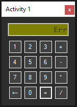

# Activity 1

## Assignment Details

> Install the current version of Visual Studio .NET on your personal computer. Once the software is
installed, create a Windows Forms Application and build a form with a variety of controls. Demonstrate your form to your instructor before leaving the class. Submit your zipped project to the LMS and include a screenshot of your program running with successful output.

## Screenshots

- An operation entered in

- An error occurred! (Divide by zero)

- Valid results from an equation

## Repositories

- [Personal GitLab (main source)](https://gitlab.scoutchorton.io/gcu/cst-150/-/tree/master/Activity1)
- [GitHub Mirror (backup/mirror)](https://github.com/scoutchorton/cst-150/tree/master/Activity1)