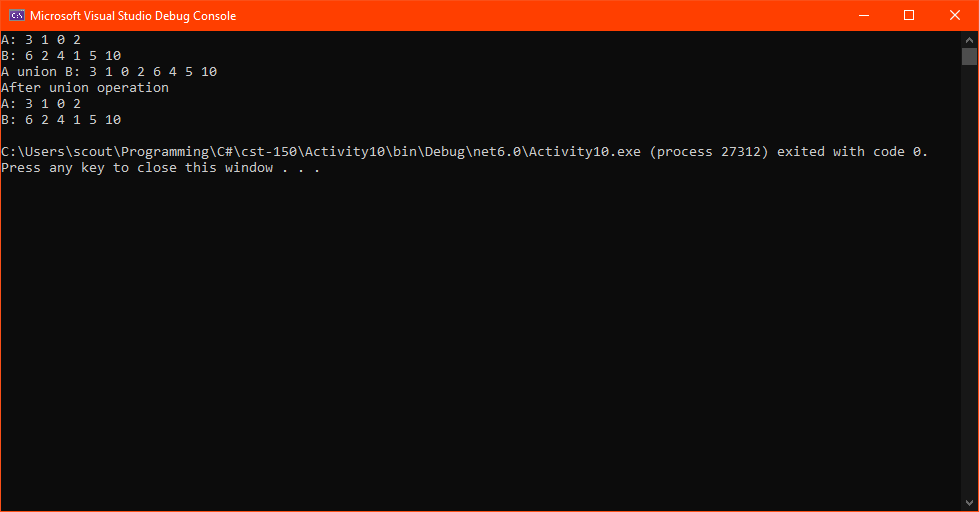

# Activity 10

## Assignment Details

> Run the following console application with the “Activity 10 Code.” This program should produce the union of two sets, but has several errors. Use a variety of debugging techniques to locate and correct the errors.
>
> NOTE: A set is a collection of like elements that does not contain any duplicates. The union of two sets is the set that contains all the elements in both sets. Formally:
>
> A union B = {x : x Î A or x Î B}
> read: A union B is the set of all x such that x is in A or x is in B
>
> Example: A = {1,2,3,4,5} and B = {2,4,6,8}, then A union B = {1,2,3,4,5,6,8} (notice, no duplicates!)
>
> Debug the program. When you find an error, comment out the offending line, give an explanation of the error, write a corrected line, and include a screenshot of your program running with successful output.

## Process

Since I write code professionally, this activity was a walk in the park. I took a data structures class in community college, so this reminded me of that class quite a bit. Once I got my environment set up, I went through the `Set.cs` file function by functions and looked over what the code does. I didn't use any developer tools, but I am familiar with how to set breakpoints and use the debugger. Between debugging C# scripts for SQL Server Integration Services (SSIS) packages at work and using the Chrome JavaScript debugger, I'm familiar with the keybindings and interfaces for GUI debuggers. I've also used `pdb`/`ipdb` for Python and `gdb` for C/C++, so I'm also familar with CLI debuggers.

The first issue I saw was in the `containsElement()` function, where the for loop has an if statement that returns `true` and an `else` clause would return `false`. No matter what, this function would return _something_ on the first iteration, and if it was true or false would depend on the condition. The only time the desired output to return before the iteration is if the element was found in the array, otherwise let the loop run to completion and return afterward. This is a common structure that I use in programming, so I commented out the `else` clause to the if statement to align with this structure.

The functions `ToString()` and `clearSet()` appeared to be bug free, so they were left untouched.

The only other function for there to be issues with would be the `union()` function, which there was a major issue with. According to the announcement for week 5:

> Note A and B need to be the same before and after the union.

and the way the function was structured would edit the left hand side (lhs) argument to the union. To prevent this, a new instance of a `Set` was created and both the lhs and right hand side (rhs) `Set`s would be merged into that instance. Since the logic is in place with `addElement()` to not add duplicates, there is no need to rework the looping logic. Once the new `Set` is incorperated, that is all the changes that are needed.

One potential restructure that could help prevent issues with the `union()` function could be to convert it to a static method. Since the output creates a new instance regardless, it would be best to make it not reference the instance. This design strategy would force the programmer into using relative instances of a `Set` instead of using the `this` variable.

Another refactor that I could have done would be to change `addElement()` to be folded down better, taking this

```c#
public bool addElement(int val) {
    if(containsElement(val)) {
        return false;
    } else {
        elements.Add(val);
        return true;
    }
}
```

into this

```c#
public bool addElement(int val) {
    if(containsElement(val)) return false;

    elements.Add(val);
    return true;
}
```

Since all the code after the if statement would be run as if the `else` clause was there, it can be removed. It also falls into a structure I developed when taking the data structures class I mentioned earlier of having state validation as the first section after variable initialization, which then leads the section afterward to have a clean slate for whatever processing is needed.

Here is the valid output from my program:

  

## Repositories

- [Personal GitLab (main source)](https://gitlab.scoutchorton.io/gcu/cst-150/-/tree/master/Activity10)
- [GitHub Mirror (backup/mirror)](https://github.com/scoutchorton/cst-150/tree/master/Activity10)
