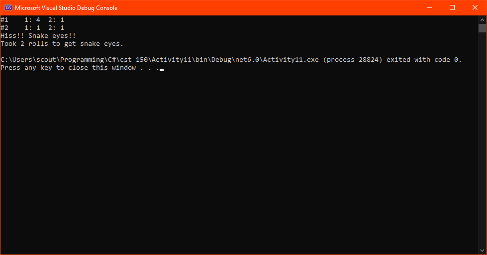
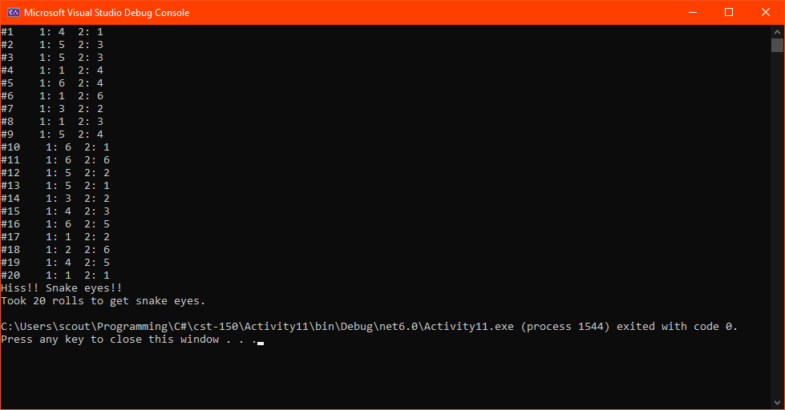
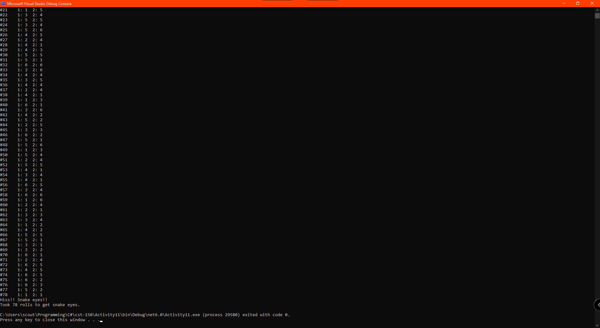

# Activity 11

## Assignment Details

> Refer to “Activity 11 Example,” and write a Dice class. The class should have:
>
> * A private field for the number of sides of the die.
> * A constructor that takes an integer between 4 and 20, inclusive and sets the number of sides of the die.
> * A method, rollDie(), returns the face value when the die is rolled. Use a Random number to “roll” the die.
>
> Write a main method that will create two die with the same number of sides, continually roll the dice, and report the result of each roll. It should stop when “snake eyes” are rolled (double 1’s) and report the number of rolls. You may write this as a console application or a Windows Forms application; include a screenshot of your program running with successful output.

## Screenshots

- Short and lucky roll

  

- Moderately lucky rolls

  

- Unlucky rolls that had to scroll/maximize the terminal

  

## Repositories

- [Personal GitLab (main source)](https://gitlab.scoutchorton.io/gcu/cst-150/-/tree/master/Activity11)
- [GitHub Mirror (backup/mirror)](https://github.com/scoutchorton/cst-150/tree/master/Activity11)