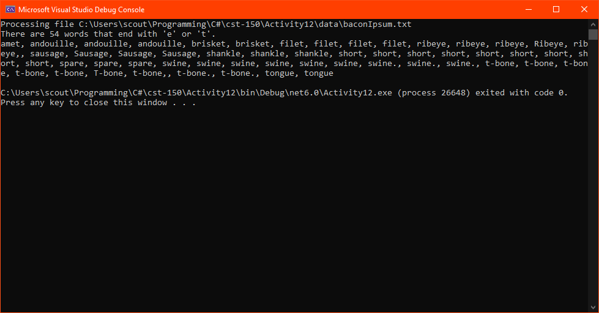
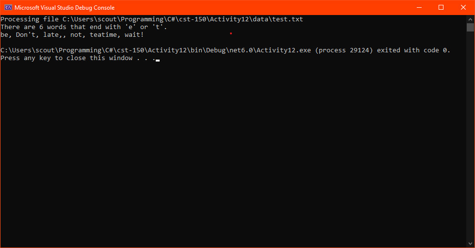

# Activity 12

## Assignment Details

> Given a text file, refer to "Activity 12 Example" and write a program (console application) that counts the number of words that end with the letter "t" or "e" (not case sensitive). We'll say that a "t" or "e" is at the end of a word if there is not an alphabetic letter immediately following it. The program should output the resulting count.

## Data Sources

- Lorem Ipsum data taken from [baconipsum.com](https://baconipsum.com/)

## Screenshots

- Output from Bacon Lorem Ipsum data

  

- Output from assignment test data

  

## Repositories

- [Personal GitLab (main source)](https://gitlab.scoutchorton.io/gcu/cst-150/-/tree/master/Activity12)
- [GitHub Mirror (backup/mirror)](https://github.com/scoutchorton/cst-150/tree/master/Activity12)
