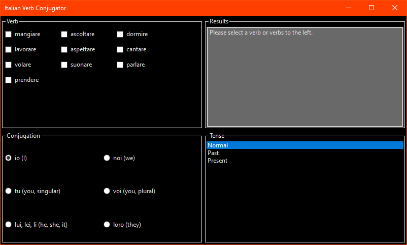
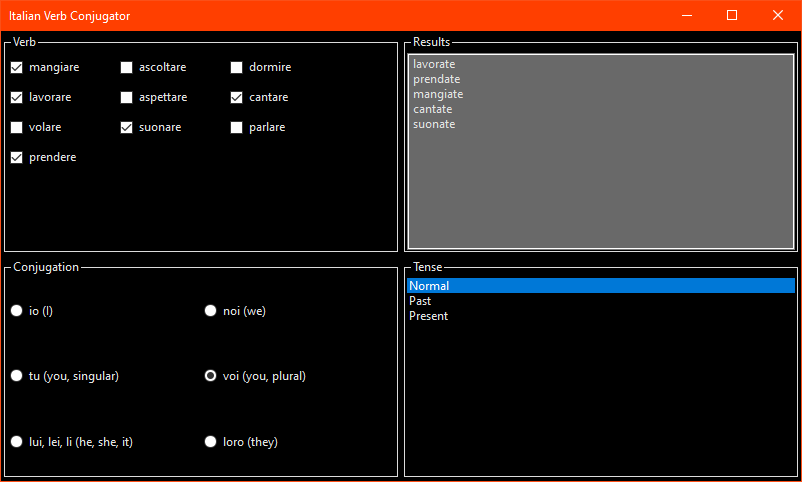
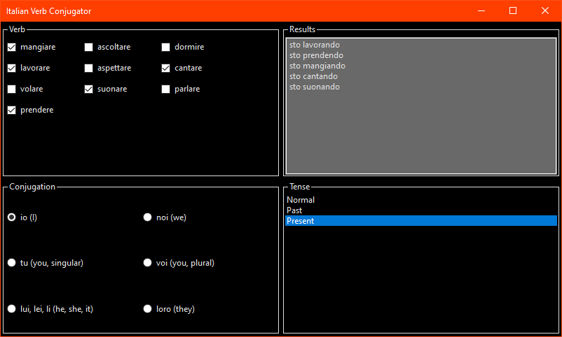
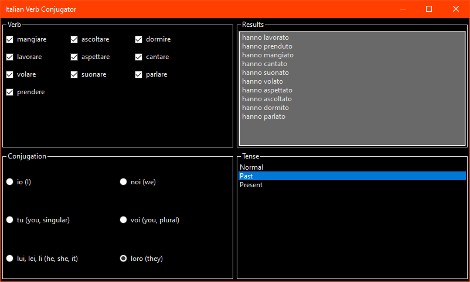
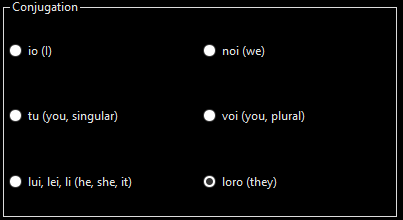
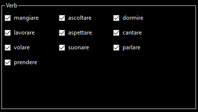
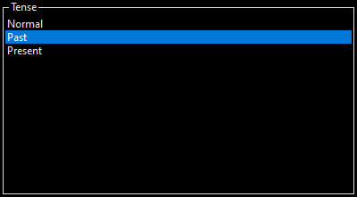

# Activity 14

## Assignment Details

Refer to "Activity 14 Example" and write a Windows Forms program that uses radio buttons, check boxes, and list boxes. Your program may do anything you wish, but should demonstrate appropriate use of each of the controls.

## Screenshots

- Initial state of the application

  

- Some verbs selected with conjugated output

  

- Updated conjugation to see update in the results

  

- Updated tense effecting all verbs

  

- Utilizing all options together at the same time

  

## Rationale

### Radio Buttons

  

  The conjugation form was something that I figured would be best if it was left to a single option instead of having multiple options. That would lead to either a radio button or the list box (which I couldn't get multiple options working). To me, having all the options laid out in a 2x3 grid made sense for the conjugation, and the way I laid it out is normally how textbooks and images online will put it, even with other Latin-based languages and even German.

### Checkboxes

  

  In order to view multiple verbs at once, I would need an option which allows for selecting multiple conditions at the same time. While a list box could do this, I wasn't able to get it working and an array of checkboxes seemed more logical. I attempted to use the `CheckedListBox` control, but had formatting issues and went with `FlowLayoutPanel` which dynamically positions the elements nicely. I also used dynamic generated at the initialization of the form to allow a custom list with a custom class to handle verb information.

### List Box

  

  The main motive for using a list box to represent the tense is mostly due to the project requirements, but also I felt that it worked well for the tense. Since the tense is a list that doesn't really need to be in a fancy layout like the tabular arrangement of the conjugation forms, a simple list would fit the job and the list box gives the events for data updates. In the future, it would be easy to add a new tense without breaking the layout, where a radio button list might struggle to adjust to the new layout, so this option would be future proof as well where the conjugation forms wouldn't change unless there is a major shift in the Italian language.

## Repositories

- [Personal GitLab (main source)](https://gitlab.scoutchorton.io/gcu/cst-150/-/tree/master/Activity14)
- [GitHub Mirror (backup/mirror)](https://github.com/scoutchorton/cst-150/tree/master/Activity14)
