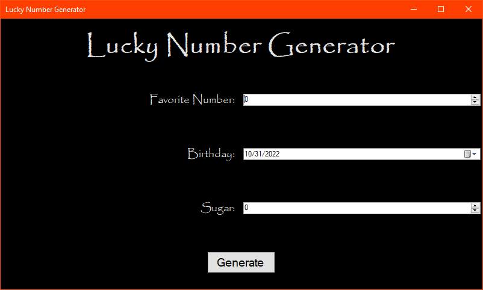
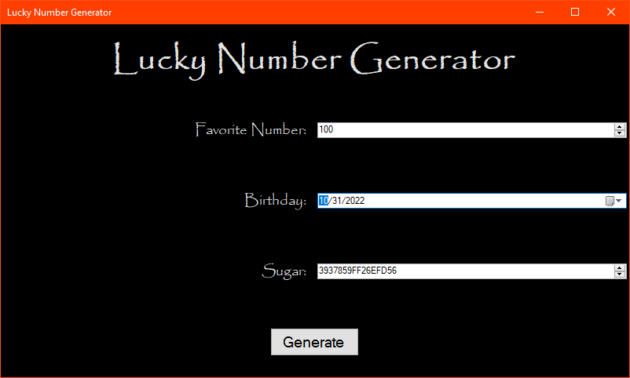
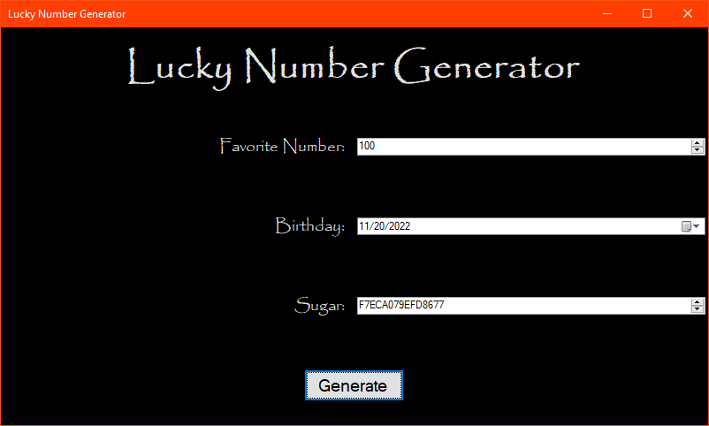
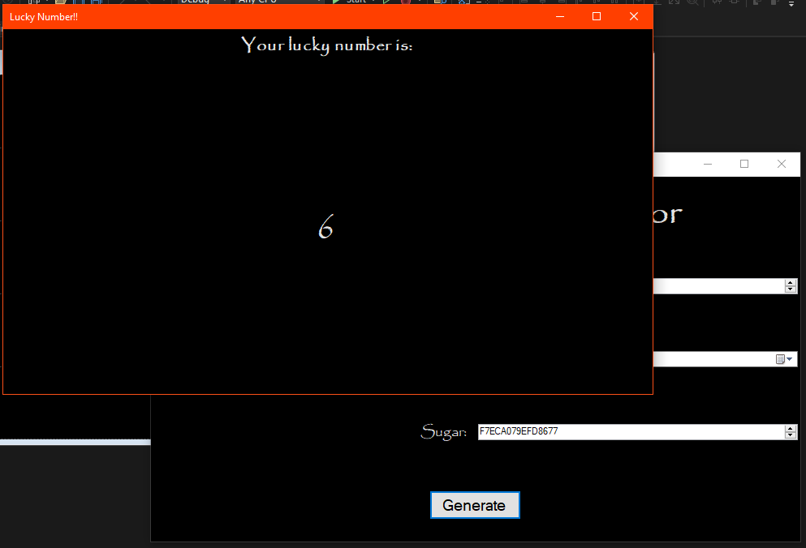

# Activity 15

## Assignment Details

> Create the Lucky Number application, shown in the “Activity 15 Possible Implementation.”  Your project can calculate Lucky Numbers any way you wish, but must include the following features:
>
> * Two forms, minimum. Each form should have a different title.
> * A programmatically populated control.
> * A control populated based on the selected item in another control.
> * An event that launches the second form.
> * A screenshot of your program running with successful output.
>
> As always, programming style, usability, and creativity matter!

## Screenshots

- Initial state

  

- Added a favorite number (notice the sugar updated)

  

- Added a fake birthday (again, notice the sugar updated)

  

- Final output with all data being used

  

## Repositories

- [Personal GitLab (main source)](https://gitlab.scoutchorton.io/gcu/cst-150/-/tree/master/Activity15)
- [GitHub Mirror (backup/mirror)](https://github.com/scoutchorton/cst-150/tree/master/Activity15)
