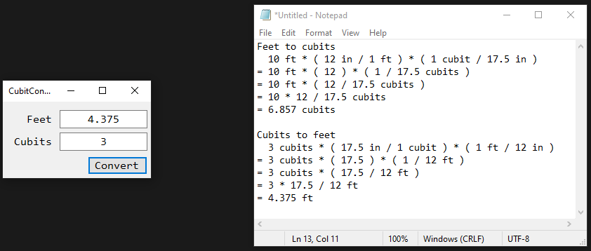

# Activity 2

## Assignment Details

> Refer to the “Activity 2 Example” and write a Windows Forms Application that prompts the user to enter a value and then converts the value to some other type of units. Your program should:
> - Use a text box for the input.
> - Have a button that, when clicked, displays the result.
> - Include a screenshot of your program running with successful output.

## Sources

- Conversion rate for Hebrew Cubits to Inches: [Ark Encounter](https://arkencounter.com/noahs-ark/cubit/)

## Screenshots

- An operation entered in

- An error occurred! (Divide by zero)

- Valid results from an equation

## Repositories

- [Personal GitLab (main source)](https://gitlab.scoutchorton.io/gcu/cst-150/-/tree/master/Activity2)
- [GitHub Mirror (backup/mirror)](https://github.com/scoutchorton/cst-150/tree/master/Activity2)