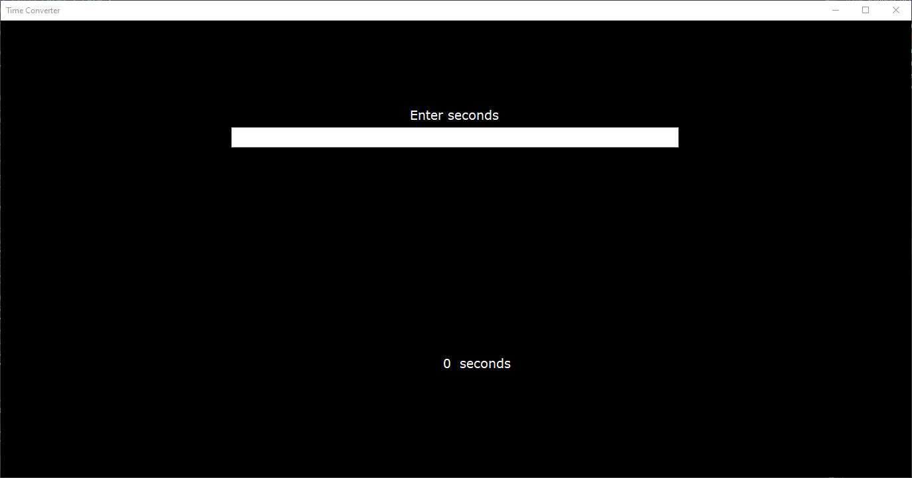
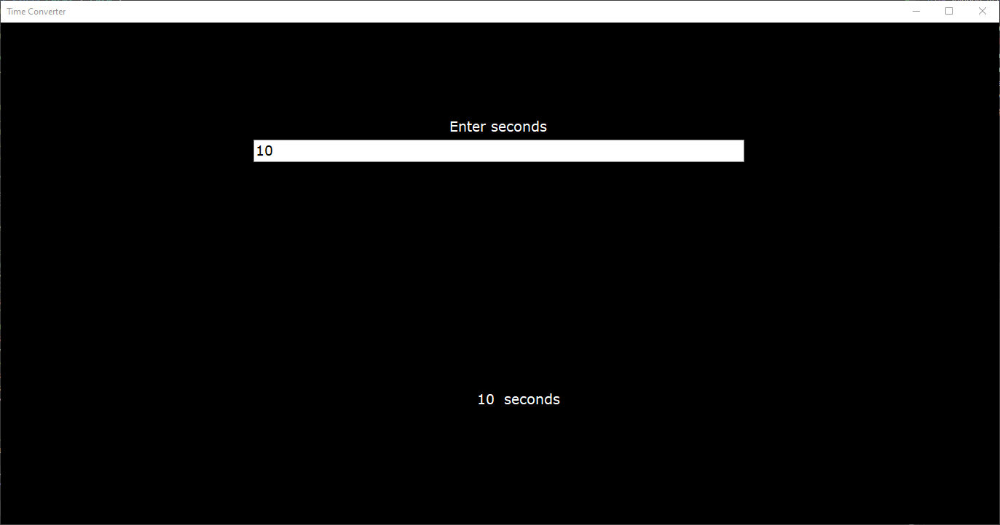
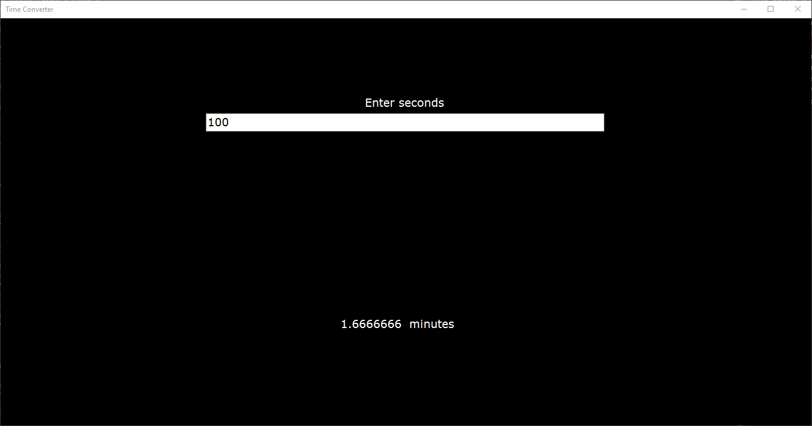
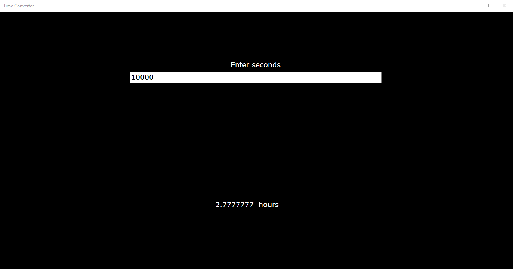
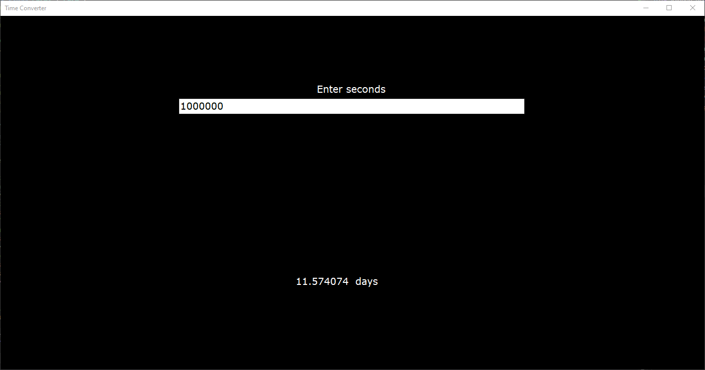
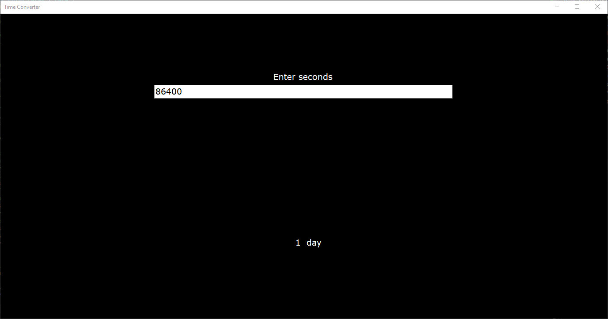
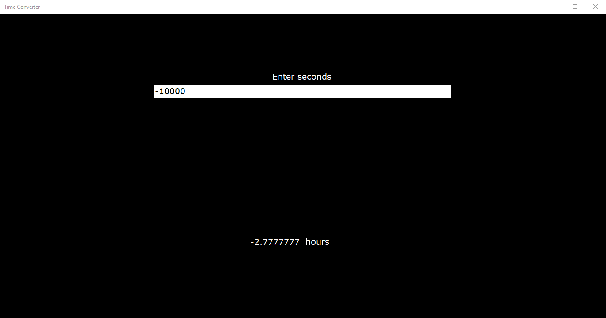
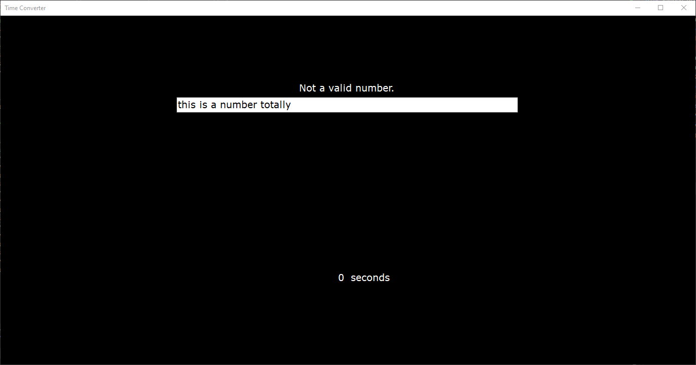

# Activity 4

## Assignment Details

> Write a Windows Forms Application that prompts the user to enter the number of seconds elapsed; include a screenshot of your program running with successful output. The program should convert the value as follows:
>
> 1. If the number of seconds is greater than or equal to 60, display the number of minutes in that many seconds.
> 1. If the number of seconds is greater than or equal to 3600, display the number of hours in that many seconds.
> 1. If the number of seconds is greater than or equal to 86,400, display the number of days in that many seconds.
>
> NOTE: This is problem 11 at the end of Chapter 4 within the textbook.
>
> HINT: Read CAREFULLY.

## Screenshots

**NOTE**: The value is updated when the text box value changes at all. There is an intentional lack of a button for that reason. (Uses the `TextChanged` event of the text box instead of `Click` on a button.)

- Startup state

- No conversion falls through to seconds (not in project specs)

- Conversion to minutes

- Conversion to hours

- Conversion to days

- Removes plurality when the value is exactly 1 (not in project specs)

- Also worked with negative time (extra step beyond `value >= 60` for something like minutes) (not in project specs)

- Unable to parse

## Repositories

- [Personal GitLab (main source)](https://gitlab.scoutchorton.io/gcu/cst-150/-/tree/master/Activity4)
- [GitHub Mirror (backup/mirror)](https://github.com/scoutchorton/cst-150/tree/master/Activity4)