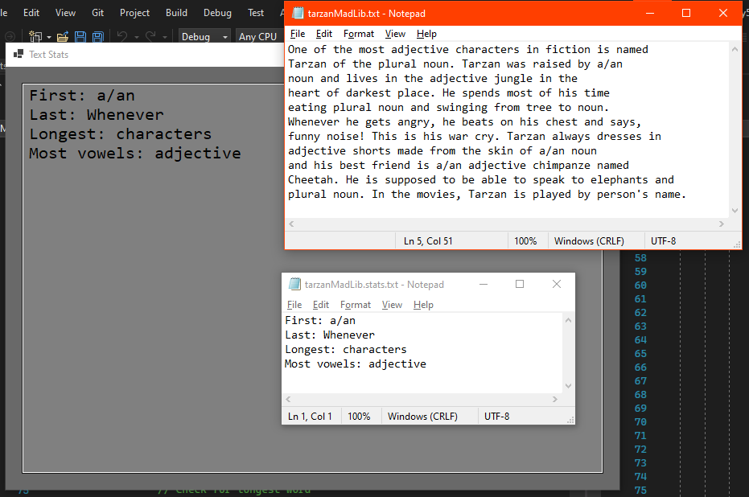
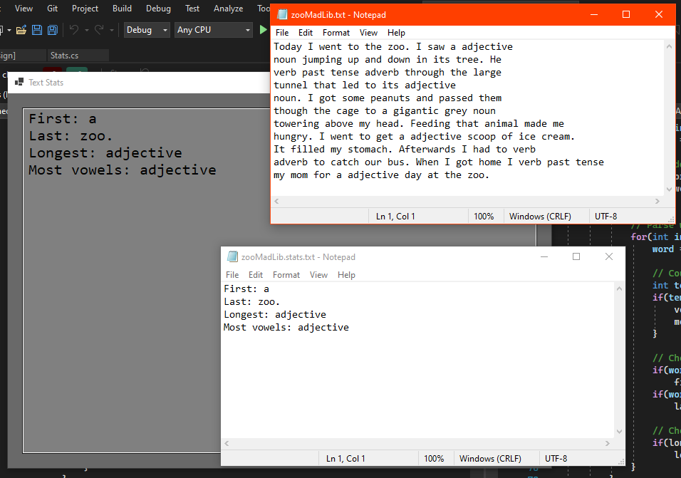
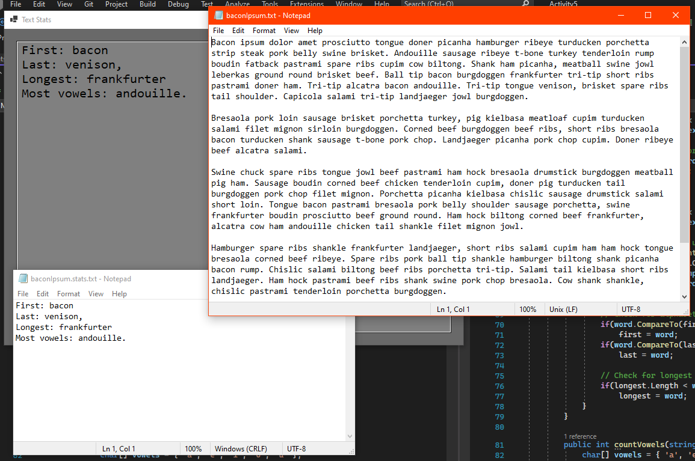

# Activity 5

## Text Sources

The `data/tarzanMadLib.txt` and `data/zooMadLib.txt` files were sourced from a friend's computer science assignment for making Mad Libs. It was a solid source of text and was the first one I thought of, so I used those files.

The `data/baconIpsum.txt` file was sourced from [baconipsum.com](https://baconipsum.com/), which I know is a goofy text/placeholder source that I use.

## Assignment Details

Write a Windows Form Application that uses a file dialog control to allow the user to select a file for input, processing the contents of the file as follows:

1. Converts all the words to lower-case.
1. Finds the first and last word alphabetically.
1. Finds the longest word.
1. Finds the word with the most vowels.

Display the above statistics in a text box and write the above statistics to a file; include a screenshot of your program running with successful output.

## Screenshots

- Example using the Tarzan file
  
- Example using the zoo file
  
- Example using the lorem ipsum file
  