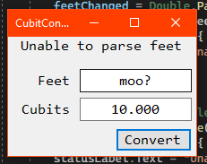

# Activity 6

_This activity is an extension of [Activity 2](../Activity2/README.md)._

## Assignment Details

> Extend the program written for Activity 2 by adding exception handling to the program. Further enhance your project by formatting all numeric output to exactly three decimal places and include a screenshot of your program running with successful output. Make the interface attractive and clean.

## Error Explaination

When running the code without proper error parsing in place, an exception for `System.FormatException` occurred (as seen below). Assuming this would be the only error that would occur related to parsing the number, I check for that on line 52 for feet parsing and line 59 for cubit parsing in `MainForm.cs`, then on lines 55 and 62 I safely handle the bad formatting cases by setting a status message added for this extension.

I wouldn't think any other errors would occur related to formatting, but I could be wrong. Frankly, any other errors that would occur should be left to not be handled, and that can be specially handled at a later time. I'd prefer to only catch the needed error rather than catch every error that could occur (not providing a error class to `catch`).

## Screenshots

- Working fine

  

- Bad value in the feet field

  

- Bad value in the cubits field

  

## Repositories

- [Personal GitLab (main source)](https://gitlab.scoutchorton.io/gcu/cst-150/-/tree/master/Activity6)
- [GitHub Mirror (backup/mirror)](https://github.com/scoutchorton/cst-150/tree/master/Activity6)