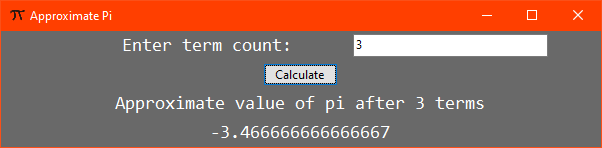
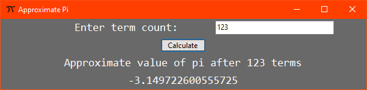

# Activity 7

## Assignment Details

> The value for pi can be approximated with the following sequence:
>
> 4 – 4/3 + 4/5 – 4/7 + 4/9 - …
>
> Refer to the “Activity 7 Example” and page 290 in Starting Out with Visual C#. Write a Windows Forms Application that prompts the user for a number of terms and CALCULATES the value of the sequence for the specified number of terms; include a screenshot of your program running with successful output. (YOU MUST USE A FOR LOOP TO DO THIS.) Do not round your result.

## Screenshots

- Testing 3 (1-10 range)

  

- Testing 123 (100-300 range)

  

- Testing 1234 (1000-3000 range)

  

## Repositories

- [Personal GitLab (main source)](https://gitlab.scoutchorton.io/gcu/cst-150/-/tree/master/Activity7)
- [GitHub Mirror (backup/mirror)](https://github.com/scoutchorton/cst-150/tree/master/Activity7)