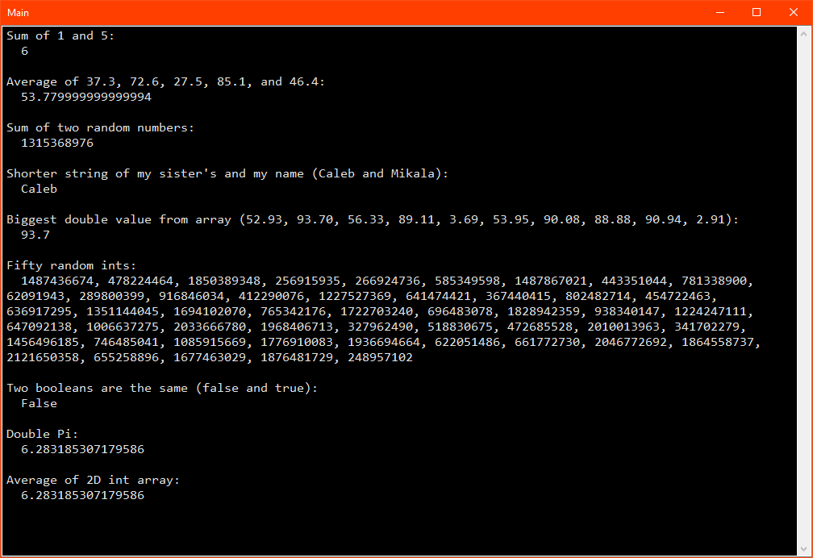

# Activity 9

## Assignment Details

> A method stub, or signature, is the first line of a method.
>
> Write a class that contains the following “stubs” for methods used in measurement conversion and include a screenshot of your program running with successful output. You do not have to implement the methods.
>
> Here’s an example:
>
> Write a void method that takes an integer for the number of millimeters and displays the number of meters.
>
> Correct response:
>
> public void showMeters(int numMillimeters){}
>
> 1. Write a method that takes two integers and displays their sum.
> 1. Write a method that takes five doubles and returns their average.
> 1. Write a method that returns the sum of two randomly generated integers.
> 1. Write a method that takes three integers and returns true if their sum is divisible by 3, false otherwise.
> 1. Write a method that takes two strings and displays the string that has fewer characters.
> 1. Write a method that takes an array of doubles and returns the largest value in the array.
> 1. Write a method that generates and returns an array of fifty integer values.
> 1. Write a method that takes two bool variables and returns true if they have the same value, false otherwise.
> 1. Write a method that takes an int and a double and returns their product.
> 1. Write a method that takes a two-dimensional array of integers and returns the average of the entries.

## Screenshots

- Successful output with conversions/examples listed

  

## Repositories

- [Personal GitLab (main source)](https://gitlab.scoutchorton.io/gcu/cst-150/-/tree/master/Activity9)
- [GitHub Mirror (backup/mirror)](https://github.com/scoutchorton/cst-150/tree/master/Activity9)
